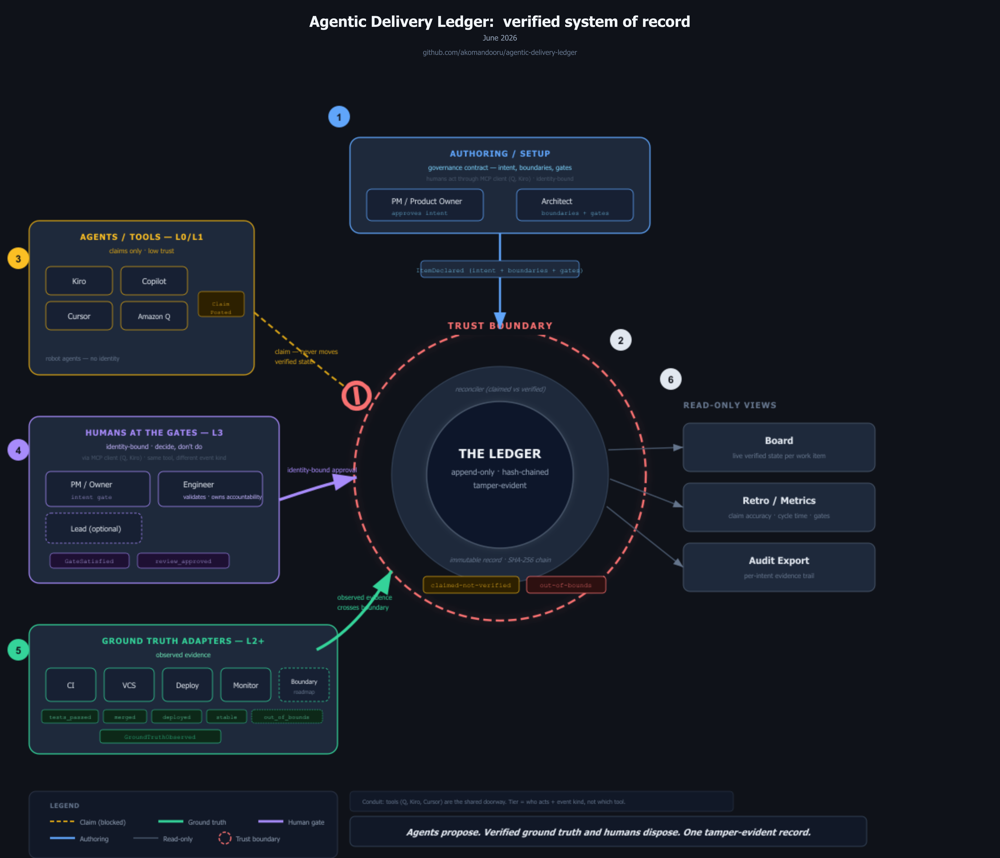
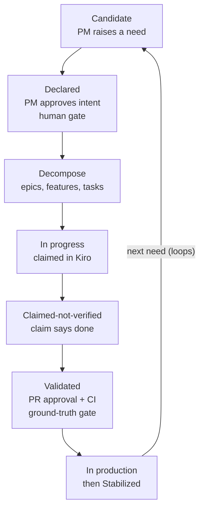
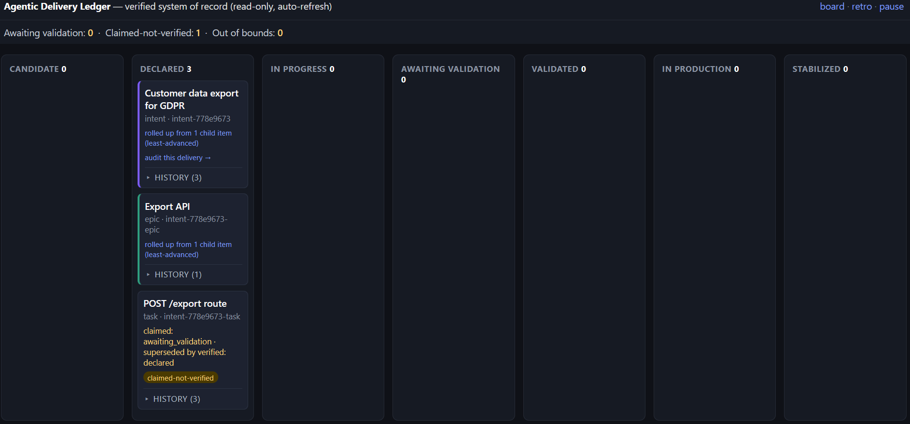
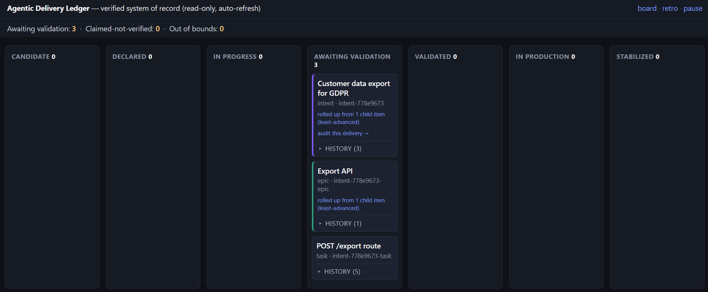
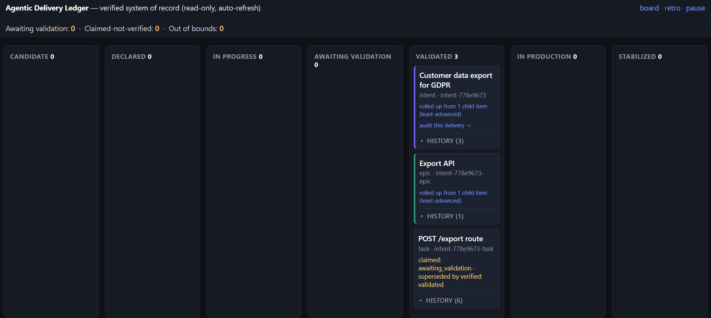
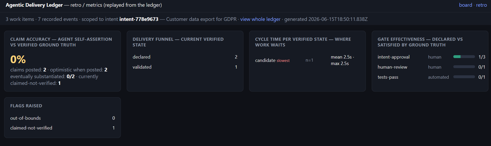
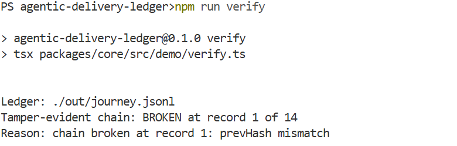

# Agentic Delivery Ledger (reference implementation)

A **verified ledger** for agentic software delivery. It tracks delivery work, the
human gates, and the difference between what agents **claim** and what is **independently
verified** against ground truth (PRs, CI, reviews).



This is the reference implementation that proves the open protocol. It is **not** the agents and
**not** the orchestrator. The full protocol spec is in [`PROTOCOL.md`](PROTOCOL.md) (with a
machine-readable [`schema/ledger.schema.json`](schema/ledger.schema.json)).

> **What this is:** an open protocol + reference implementation showing the art of the possible
> for governing agentic software delivery. It deliberately **builds on emerging agent-audit
> standards** (IETF AAT, OpenKedge/IEEC) and applies them to a domain they do not yet cover (the
> SDLC). The goal is a useful, standards-aligned open contribution, not a proprietary moat.

## Why this exists (the problem)

AI now writes a large and rising share of code, across many tools (Claude Code, Copilot, Cursor,
Amazon Q, Kiro, ...). Adoption has outrun governance: a 2026 survey of 831 engineers put AI
coding-tool use at ~97% but full governance at only ~30% [Black Duck/UserEvidence]. Two problems
follow that no single agent vendor solves, because each only sees its own usage:

- **No one can vouch for AI-written work.** Which AI changes were validated by a human, against
  what intent? Roughly two-thirds of organizations can't distinguish AI-agent from human actions
  after the fact [CSA/Aembit], ~84% doubt they'd pass an audit of agent behavior [CSA/Strata],
  and ~87% credit AI output entirely to a human, unable to prove what the AI did [Lanai]. In the
  repositories we examined, the code-level picture matched: structured records linking an AI
  change to a stated intent and a human validation were essentially absent, because there was
  nowhere to record them.
- **No consolidated, trustworthy view.** Leadership, platform, and risk/compliance cannot see
  where work is, what it is waiting on, or prove an audit trail — especially in regulated
  industries (finance, healthcare, public sector) where change-management and audit-evidence
  rules already apply to AI output.

This project is the neutral, tool-agnostic layer that fills that gap: a verified record of what
was intended, whether agents stayed in bounds, and whether a human validated the result, with
the audit trail as a byproduct. (Figures paraphrased from the cited 2026 reports; see
[Sources](#sources).)

**Why it matters:** this is a latent liability until a forcing function lands. The EU AI Act
(full enforcement August 2026), SOC 2, and ISO 42001 require audit trails and human-oversight
evidence; without them you fail audits and cannot sell into regulated markets. And when
AI-written code causes an incident, "who approved this and why?" has no answer. Regulated teams
feel this now; everyone else feels it at the first audit or incident.

## Architecture (the record + reconciler is the core)

The MCP server and the ground-truth adapters are **inputs**; the board and audit export are
**outputs**. The defensible core is the **record + reconciliation engine** in the middle, which
turns agent claims into trustworthy state by checking them against verified ground truth. The
diagram at the top of this README shows the whole shape: claims stop at the trust boundary, only
ground truth and identity-bound humans cross it, and the views are read-only.

**On trust:** the two inputs are not equal. An agent's **claim** is self-asserted and low-trust;
**ground truth** (a real PR approval, passing CI, an identity-bound human gate) is trusted. The
reconciler advances **verified** state only from trusted ground truth, so a claim is recorded but
never validates an item on its own. (This maps to the IETF AAT trust levels L0-L4: claims = L0/L1,
ground truth = L2+. See `STANDARDS.md`.)

- **MCP server** = doorway (claims are recorded, never trusted as verified).
- **Ground-truth adapters** = feeders of real evidence (metadata only).
- **Record + reconciler** = the trustworthy core (with the protocol, the part that must be right).
- **Board / audit** = read-only views over the record.

## Standards alignment (build on, don't reinvent)

The "verified intent → outcome" idea is an active 2026 concept. This project aligns with the
emerging standards and applies them to the **software delivery lifecycle** (which they don't yet
cover), positioning itself as a domain profile: **"AAT/IEEC for agentic software delivery."**

- **IETF Agent Audit Trail (AAT)** (`draft-sharif-agent-audit-trail`) — we adopt its record
  conventions: tamper-evident **SHA-256 hash chaining** over canonical JSON (RFC 8785 JCS),
  genesis/close session structure, `trust_level` (L0-L4), and `human_override`. The event log is
  hash-chained so any modification is detectable.
- **OpenKedge / IEEC** (Intent-to-Execution Evidence Chain, arXiv 2604.08601) — we adopt its
  model: intent → context → policy/gates → bounds → outcome. Our intent boundaries + gates are
  the SDLC analogue of OpenKedge execution contracts.

| Our concept | Standard equivalent |
|-------------|---------------------|
| Claimed state (agent self-assert) | low AAT `trust_level` (L0/L1) |
| Verified state (ground truth) | higher AAT `trust_level` (L2+) |
| Human gate approval (identity-bound) | AAT `human_override` / `escalation` |
| Hash-chained event log | AAT audit record + `prev_hash` chain |
| intent + boundaries + gates → outcome | OpenKedge intent/contract + IEEC |

How they differ in domain: AAT/OpenKedge govern **production-runtime agent actions** (an agent
restarted a service, denied a loan). This project governs **SDLC delivery work** (AI-written code
from intent to shipped), anchored in git/PR/CI ground truth, across coding tools. Same
verification primitive, different machine. See `STANDARDS.md` for the full mapping.

## The one idea

> Agents post **claims**. Authoritative state moves only on **verified** ground truth.
> A claim of "done" shows as `claimed-not-verified` until a real human approval and passing
> checks confirm it. That is the whole trust model, and the demo punchline.

## The full journey (one living board, no project/support split)

Work flows continuously, humans act only at the gates, agents do the motion:



In this reference implementation: the upstream gates (raise/approve) run live via the Q-style
MCP client; the execute->validate slice runs live via Kiro; remaining stages are seeded so the
whole journey is visible on one board. Every gate is recorded, so the audit trail is a byproduct.

## What it looks like

The board is the live, read-only view over the ledger. Watch one task move only as evidence arrives, never on a claim alone.

**1. The agent claims it's done.** The board does not advance it. It flags the card `claimed-not-verified` and holds.



**2. CI passes (ground truth).** The card advances to Awaiting validation, and the flag clears as verified state catches up to the claim. A human gate is still open.



**3. A human approves (ground truth).** Now, and only now, it is Validated.



The retro view turns verification into numbers: how often agents claimed ahead of evidence, where work waited, and which gates actually fired.



The whole record is tamper-evident. `npm run verify` walks the hash chain: change any past entry and it reports exactly where the chain breaks, so the audit trail cannot be quietly rewritten.



## Layout (npm workspaces, TypeScript)

```
packages/
  protocol/  the published schema + types + inheritance/roll-up (the standard)
  core/      record store (event log), reconciliation engine, GitHub adapter, audit + retro/metrics
  mcp/       governance MCP server (agent claim interface; client-agnostic)
  board/     thin read-only board (zero-build HTTP view over the record)
  aidlc-extension/  opt-in AI-DLC drop-in: the `adlx` writer, hooks, and rule pack (see its README)
```

The **AI-DLC Verification Extension** (`packages/aidlc-extension`) applies this protocol to an
[AI-DLC](https://github.com/awslabs/aidlc-workflows) run without forking or editing AI-DLC. For how
to adopt and run it, see [`packages/aidlc-extension/README.md`](packages/aidlc-extension/README.md);
for the why, see [`docs/ai-dlc-verification-extension.md`](docs/ai-dlc-verification-extension.md).

## Run it

Prereqs: Node 18+ (tested on 22), npm. For the optional live Kiro claim: Kiro with the bundled
`.kiro/settings/mcp.json`. For *real* ground truth: GitHub CLI (`gh`) logged in (optional — the
runs below use mock providers and need no external systems).

```bash
npm install
npm test            # protocol + core tests (inheritance, roll-up, claimed-vs-verified, chaining)
npm run journey     # walk the full journey above, stage by stage (primary)
```

### `npm run journey` — walk the full journey (the diagram above, interactively)

This steps through the exact lifecycle shown in the diagram and pauses at each stage. At the
**claim** step you can either do it **for real in Kiro** or type `m` to mock it. The external
stages (ground truth, decomposition, operator) use mock providers, while every transition still
goes through its real path.

- **Zero setup:** just run it and mock the claim (`m`) — no board, no Kiro needed to try it.
- **Live claim (optional):** in another terminal run the board on the journey record, then do
  the claim from inside Kiro:
  ```bash
  # use an ABSOLUTE path: `-w @adl/board` runs from packages/board, so a relative ADL_DB
  # would resolve against the wrong directory and the board would look empty.
  ADL_DB="$PWD/out/journey.jsonl" PORT=4000 npm start -w @adl/board   # open http://localhost:4000
  ```
  `.kiro/settings/mcp.json` already points `ADL_DB` at `./out/journey.jsonl`. In Kiro: "list
  work items", "claim &lt;task id&gt;", "mark it done" → the board shows **claimed-not-verified**;
  it flips to **Validated** only when ground truth arrives. Verification, not the claim, drives
  authoritative state.

In a real terminal the journey prompts you; when piped or run with `JOURNEY_AUTO=1` it
auto-advances (mocking the claim) so it is CI-friendly.

### `npm run e2e` — the same journey, fully automatic

Runs the complete lifecycle end to end with no prompts and no external systems, printing the
board after each stage and verifying the tamper-evident chain at the end. Use this when you just
want to watch it run.

| Stage | How it runs |
|-------|-------------|
| PM raises a need → Candidate | real `raiseNeed` |
| PM approves intent → Validated | real `approveIntent` (identity-bound human gate) |
| Decompose into epic + task | a planner declares child items (inherits gates) |
| Dev claims + marks done → claimed-not-verified | real `ClaimPosted` (claim only) |
| Ground truth (tests + approval) → Validated | **mock ground-truth adapter** + `ingest()` (drop-in for GitHub) |
| Merged → In production → Stabilized | mock ground truth |
| Monitoring raises the next need (loop) | mock operator signal |

Crucially, the **mock ground-truth adapter is a real adapter** (same interface as the GitHub
one); it only emits signals you set on it. Ground truth is never posted by an agent, so the
claimed-vs-verified trust model holds. Swap `MockGroundTruthAdapter` for `GitHubAdapter` to run
the same flow against a real repo.

### Other entry points
- **`npm run verify`** — verify the tamper-evident hash chain of a ledger and exit non-zero if it
  is broken (so it can gate CI). Run it, change any single character inside one line of
  `./out/journey.jsonl`, and run it again to watch it report `BROKEN` at the first tampered record:
  ```bash
  npm run verify                      # verifies ./out/journey.jsonl
  npm run verify -- ./out/e2e.jsonl   # verifies a specific ledger
  ```
- **`npm run demo`** — seeds the journey and drives the claim→verify slice automatically,
  printing the board. A quick non-interactive look.
- **`npm run retro`** — a read-only **retro / metrics** report replayed from the ledger:
  claim accuracy (how often agents claimed a state before ground truth confirmed it, and whether
  it was eventually substantiated), cycle time per verified state (where work waits), gate
  effectiveness (declared vs satisfied), the delivery funnel, and flags raised. Because the log
  is immutable and timestamped, a retrospective is a replay of facts, not a reconstruction. Scope
  it to one intent's subtree for an "audit this delivery" view:
  ```bash
  ADL_DB=./out/journey.jsonl npm run retro                  # whole ledger
  ADL_DB=./out/journey.jsonl npm run retro -- <intent-id>   # one intent + its descendants
  ```
  The same metrics are available visually at `http://localhost:4000/retro` (the **retro** tab on
  the board); each intent card links to its scoped report via "audit this delivery →".
- **`npm run client-demo -w @adl/mcp`** — the upstream PM flow via a local (Q-style) MCP client,
  standing in for "a PM acting through Amazon Q" (same MCP protocol the server would see from Q).
  It raises a need (Candidate), approves the intent with a verifiable identity (recorded as
  auditable ground truth), and shows that an **unverified** approval is rejected:
  ```bash
  ADL_DB=./out/journey.jsonl npm run client-demo -w @adl/mcp
  ```

## Extensibility points

The two planes are designed to be extended without touching the core:

### Add a new MCP client (any agent/tool)
Nothing to build server-side — the MCP server is **client-agnostic**. Any MCP-capable tool
(Kiro, Amazon Q, Cursor, a CI bot, a script) connects to the same server and calls the same
tools (`list_work_items`, `claim_item`, `update_status`, `raise_need`, `approve_intent`).
- Register it the way that tool expects (for Kiro: `.kiro/settings/mcp.json`).
- Claims set claimed state only; gate approvals require a verifiable identity.
- See `packages/mcp/src/client-demo.ts` for a minimal client.

### Add a new ground-truth adapter (a new evidence source)
Implement the `GroundTruthAdapter` interface (`packages/core/src/adapters/ground-truth.ts`):

```ts
export interface GroundTruthAdapter {
  readonly name: string;
  observe(itemIds: string[]): Promise<GroundTruthObservation[]>; // metadata only
}
```

Map your source's facts to the shared signals (`pr_opened`, `review_approved`, `tests_passed`,
`merged`, `deployed`, `stable`, `out_of_bounds`); the reconciler does the rest. `GitHubAdapter`
(`packages/core/src/adapters/github.ts`) is the worked example. Candidates to add: GitLab,
Bitbucket, a CI system, or an observability source that raises new candidate intents.

## What is in scope (and what is not)

In scope: the protocol, the record + reconciliation, a GitHub ground-truth adapter, the MCP
claim + gate-approval interface (Kiro + a Q-style client), a thin board, audit export
(`auditForIntent`, metadata-only roll-up by intent), a retro/metrics view (claim accuracy, cycle
time, gate effectiveness, with per-intent scoping), and a seeded full-journey demo.

NOT in scope (deliberately): real coding agents, orchestration, git write-back, autonomous
production action, hosting/multi-team/auth/SSO, a polished product-grade UI. Those would belong
to a production deployment, not this reference implementation, whose job is to prove the protocol
and show the art of the possible.

## Notable implementation choices
- **Storage:** append-only JSONL event log (the design permits JSON files for the reference
  impl). Current state is a projection over events, so the audit trail is the source of truth.
- **Board:** a zero-build Node HTTP view rather than a React/Vite app, to keep it lean and
  one-command runnable. Still a thin read view over the record.
- **GitHub adapter:** uses a `gh`-based, metadata-only approach (PR/review/CI signals only,
  never source code).

## License
Apache-2.0.

## Sources

Industry figures above are paraphrased from third-party 2026 reports. Verify exact numbers at the
primary sources before reuse:

- Black Duck / UserEvidence, *AI coding adoption & governance* (survey of 831 engineers, 2026):
  ~97% AI coding-tool use, ~30% with full governance.
  https://www.prnewswire.com/news-releases/ai-coding-hits-97-enterprise-adoption-new-black-duck-study-shows-governance-is-the-roi-multiplier-302794103.html
- Cloud Security Alliance / Aembit (2026): ~68% of organizations cannot distinguish AI-agent
  from human actions after the fact.
  https://cloudsecurityalliance.org/articles/more-than-two-thirds-of-organizations-cannot-clearly-distinguish-ai-agent-from-human-actions
- Cloud Security Alliance / Strata, *Securing Autonomous AI Agents* (2026): ~84% doubt they could
  pass a compliance audit of agent behavior/access.
  https://cloudsecurityalliance.org/press-releases/2026/02/05/cloud-security-alliance-strata-survey-finds-that-enterprises-are-in-time-to-trust-phase-as-they-build-ai-autonomy-foundations
- Lanai, *2026 AI Labor Report*: ~87% credit AI-assisted output entirely to the human employee.
  https://www.prnewswire.com/news-releases/lanai-releases-2026-ai-labor-report-enterprises-are-using-ai-at-scale-but-cant-prove-what-it-produces-302795069.html
- Standards: IETF Agent Audit Trail (`draft-sharif-agent-audit-trail`,
  https://datatracker.ietf.org/doc/draft-sharif-agent-audit-trail/); OpenKedge / IEEC
  (https://arxiv.org/abs/2604.08601). See `STANDARDS.md`.
- The repository-level observation ("structured intent+validation records essentially absent") is
  our own measurement on a small sample, and is exploratory (not a large-N study).
