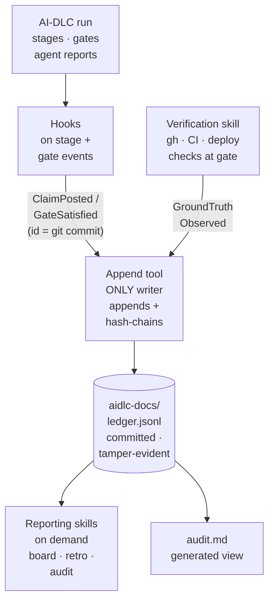

*Vision and design*

# The AI-DLC Verification Extension

**An opt-in extension that gives AI-DLC a verified, tamper-evident system of record: it turns the methodology's in-session approvals and self-reported compliance into claims that are independently checked against ground truth, so "we followed the process" becomes "here is the proof."**

---

## The one line

AI-DLC governs the process. This extension governs the truth. It records every agent claim and human gate from an AI-DLC run into a hash-chained ledger, reconciles those claims against real ground truth (PRs, CI, reviews, deploys), and exposes the gap between what was claimed and what was verified.

## Value proposition

AI-DLC already structures AI-assisted delivery into gated, audited phases. What it cannot do today is prove that the gates meant anything. Its audit is an editable markdown file, its "compliance" summary is the model asserting its own compliance, and its verification is a human approving documents rather than evidence confirming reality. The Operations phase, where real production signal would live, is a placeholder.

The Verification Extension fills exactly that gap, using AI-DLC's own extension mechanism:

- **Claims are recorded but never trusted.** Anything an agent reports (stage complete, tests pass, compliant) is captured as a *claim*, not as truth.
- **Verified state moves only on ground truth.** PR approvals, passing CI, merges, and deploy or monitoring signals are what advance authoritative state, checked by a verification skill against real evidence.
- **The record is tamper-evident.** Every event is hash-chained, so altering or deleting history breaks the chain and is detectable. The audit trail becomes a byproduct you can stand behind, not a file anyone can quietly edit.
- **The gap is measured.** Claim accuracy, where work waited, and which gates actually fired become numbers, so a rubber-stamped gate is detectable instead of invisible.

In short: it upgrades AI-DLC from "guided process with a logbook" to "guided process with a verifiable system of record."

## Why it matters

Three forces make this more than a nicety:

1. **The accountability shift.** When an agent authors the code, it cannot be accountable. Accountability transfers to whoever approves. An approval that was never really earned is false assurance, which is worse than no review because it is invisible until the incident or audit. AI-DLC's gates create the approval; only verification makes it real.
2. **The governance gap is real, and structural.** AI coding-tool use is near 97% while full governance sits around 30%: adoption has outrun the ability to govern it. And the gap is structural, not just cultural. There is no native place to record a gate, an intent link, or a claimed-versus-verified distinction (a pull request has no field for any of it), so even a team that gates diligently leaves little durable evidence behind. This extension is where that evidence would persist.
3. **Regulation.** EU AI Act enforcement (August 2026), SOC 2, and ISO 42001 require audit trails and human-oversight evidence. "We ran AI-DLC" is not evidence; a tamper-evident, claimed-versus-verified record is.

## What it is, conceptually

A self-contained, opt-in AI-DLC extension that lives entirely inside the repo, exactly like AI-DLC itself. There are no servers to run and nothing to host. It adds four things, all in-harness:

- **A committed ledger file.** A hash-chained event log at `aidlc-docs/ledger.jsonl`, a sibling to `audit.md` but structured and tamper-evident, and (unlike today's gitignored audit) committed to git so it travels with the repo and is reviewable in pull requests.
- **A deterministic append tool.** A small tool (the AI-DLC `bun`-tool pattern) that is the only thing allowed to write the ledger: it appends an event and recomputes the hash chain. The model triggers it but never edits the ledger by hand.
- **Hooks** that fire the append tool on stage and gate transitions, so claims and approvals are recorded without changing any agent prompt.
- **Read-only reporting skills** (board, retro/metrics, audit report) that read the ledger file and render on demand, in-session, instead of a running service.

When enabled, recording-to-the-ledger is a hard constraint: a gate cannot be presented as passed until its claim and verification status are appended. When disabled, AI-DLC runs exactly as before. Metadata only; no source code is read or stored.

## How it works (the pieces, all in-harness)

- **Claims and gates via hooks.** AI-DLC already runs a PostToolUse audit-logger hook that appends to `aidlc-docs/` on every write. The same pattern calls the append tool to record a `ClaimPosted` at a stage report and a `GateSatisfied` at an approval. No MCP server, no transport, no network auth surface.
- **Ground truth via a verification skill.** At a gate, the agent runs a verification skill that calls tools already in the harness (`gh pr view`, CI status, a deploy or monitoring check). The skill appends `GroundTruthObserved` events from the *tool output*, and the reconciler advances verified state only from those.
- **Identity from git.** The approver's identity is the git commit author, ideally a signed commit, so the human gate is bound to a real, recorded identity with no separate auth system.
- **Reporting as skills.** "Show the board", "show the retro", "audit this delivery" are read-only skills that project the ledger file into a markdown board, the claim-accuracy / cycle-time / gate metrics, or a scoped audit report. On demand, no server.

### The one rule that makes it trustworthy

The ledger must be written **only** by the deterministic append tool, and ground-truth events must come from real tool output, never from the model writing JSON by hand. If the model could edit the ledger directly, it could fabricate a `GroundTruthObserved`, and the entire claimed-versus-verified guarantee would collapse. So: the model triggers the tool; the tool writes and chains; the model never edits the ledger. This is the same discipline AI-DLC already uses for its deterministic engine and hooks.

## Built on the open protocol

This extension is not a new format. It is a conforming implementation of the open Agentic Delivery Ledger protocol ([`PROTOCOL.md`](https://github.com/akomandooru/agentic-delivery-ledger/blob/main/PROTOCOL.md), with the machine-readable `schema/ledger.schema.json`). The protocol is language- and host-agnostic by design: the standalone reference (MCP server plus board) and this in-repo AI-DLC extension are two realizations of the same shapes (`WorkItem`, `RecordEvent`) and the same normative rules (hash-chained log, claims never advance verified state, verified moves only on L2+ ground truth, human gates require human ground truth, flag divergence, inherit and roll-up, metadata only).

Conformance, not code reuse, is the bar. The extension may import the reference core or re-implement the rules in AI-DLC's own tooling; either is valid as long as it conforms. The acceptance test is the protocol's own worked example (PROTOCOL.md section 5): replay those events and confirm the item reads `claimed-not-verified` after the claim, flips to `validated` only after tests and a human approval, and that altering any past event breaks the chain. Because both realizations speak the same protocol, their records mean the same thing and interoperate, which is the point of an open spec rather than a single tool.

## The mapping: AI-DLC artifacts to ledger work items

| AI-DLC | Ledger |
|--------|--------|
| Intent / Requirements (Inception) | `intent` work item, with its acceptance criteria bound as the verification target |
| Units / decomposition | `epic` / `feature` / `task` work items, inheriting boundaries and gates |
| Stage gate ("wait for explicit approval") | identity-bound human gate (`GateSatisfied`, trust level L3) |
| Agent stage output ("stage complete", "tests pass") | `ClaimPosted` (claimed state, trust level L0/L1) |
| Build-and-Test results, PR/CI/deploy signals | `GroundTruthObserved` (trust level L2+) feeding verified state |
| `audit.md` (editable markdown) | hash-chained event log (tamper-evident system of record) |
| Per-stage compliance summary (self-asserted) | claimed-versus-verified reconciliation + flags |

Binding the spec's acceptance criteria as the verification target is the linchpin (Gap B in the ledger roadmap): it makes verification content-level rather than lifecycle-state-level.

## The claimed-versus-verified flow inside an AI-DLC run

1. AI-DLC reaches a stage gate. The agent reports the stage is done. The extension records a **claim** in the ledger.
2. The ledger does not advance authoritative state. The item shows `claimed-not-verified`.
3. Ground truth arrives from the verification skill the agent runs at the gate: CI passes, a reviewer approves, the change merges. Each is appended as a `GroundTruthObserved` event from real tool output.
4. The reconciler advances **verified** state only from those L2+ signals, and the flag clears when verified catches up to the claim.
5. The human gate is recorded as an identity-bound approval, not an anonymous click.
6. AI-DLC's per-stage compliance summary now reads from the ledger: compliant means verified, not merely asserted.

The agent's honest ceiling is "awaiting validation." Everything past that is ground truth, exactly as in the standalone ledger.

## Architecture (components and data flow)

Everything runs inside the repo, in whatever harness you already use (Claude Code, Kiro CLI, Codex). No services.

The append tool is the only writer (the model triggers it but never edits the ledger by hand); ground-truth events come from real tool output; and `audit.md` can remain as a generated, human-readable view over the same ledger.

## What it replaces or augments

- **Augments** AI-DLC's gates with a git-bound, recorded approver instead of an anonymous click.
- **Replaces** the editable `audit.md` as the source of truth with a committed, hash-chained `ledger.jsonl` (audit.md can remain as a generated human-readable view).
- **Fills** the Operations placeholder: the verification skill's deploy and monitoring checks are what let an item reach "in production" and "stabilized" on real signal.
- **Reframes** the self-asserted compliance summary as claimed-versus-verified, read from the ledger, so a model reporting "compliant" is checked rather than trusted.

## Implementation phases

This maps directly onto the ledger roadmap, built in dependency order, and stays entirely in-repo:

1. **Ledger file + append tool + hooks (Gap B linchpin).** Create the committed, hash-chained `ledger.jsonl`, the deterministic append tool that is its only writer, and hooks that record a claim at each stage report and a `GateSatisfied` at each approval. Bind the spec's acceptance criteria as the verification target, and use the git commit identity for the approver. Outcome: every gate produces a claim and a verification status in a tamper-evident, committed ledger.
2. **Verification skill (ground truth).** A skill the agent runs at the gate that calls `gh` / CI and appends `GroundTruthObserved` from the tool output; later extend it with deploy and monitoring checks to fill the Operations placeholder. Outcome: verified state moves on real signal.
3. **Reporting skills.** Read-only board, retro/metrics, and audit-report skills that project the ledger on demand. Outcome: visibility and an auditor-ready export with no service to run.
4. **Spec pressure-test (Gap A).** A spec-scoped, checklist-backed skill that records "spec is well-formed and testable" before generation. Outcome: verification has a sound target.
5. **Close the loop (Gap C).** Feed claim-accuracy-by-criterion, anchored on production ground truth, back into spec quality and prompting. Outcome: the workflow improves itself with evidence.

## Scope and non-goals

- **Per-workflow, per-repo loop.** A file-in-repo ledger governs one AI-DLC run on one repo. Cross-team, cross-repo aggregation is not this; see the scale-out section.
- **On-demand reporting, not an always-on board.** Reports are rendered when asked, in-session. There is no live shared dashboard in the self-contained form.
- **Tamper-evident at the git layer, not tamper-proof.** The hash chain plus committed history (plus signed commits) makes tampering detectable and expensive, but a local actor with write access could rewrite the file and recompute hashes. A shared remote and signed commits raise the bar; cryptographic prevention is a scale-out concern.
- **Ground truth is pull-at-gate, not continuous.** A skill run at the gate will not catch post-merge or production drift unless re-run. Continuous, event-driven signal is a scale-out concern.
- **The append-tool rule is load-bearing.** The model must never write the ledger directly; only the deterministic tool appends and chains. Without that, none of the guarantees hold.
- **Metadata only.** No source code is read or stored, consistent with the govern-without-ingesting-code principle.

## Scale-out: the hosted spine (optional)

Everything above is per-repo and self-contained, which is the right fit for governing a single AI-DLC run. When you genuinely need a shared, always-on, cross-team view, the same ledger model scales out into a service: the MCP server (already in the reference build) as a networked write path, a hosted board, event-driven ground-truth adapters, and a real datastore with external anchoring or signing for true tamper-proofing and a real identity verifier. That is a larger build with real hardening (auth, multi-tenant, storage, signing), and it is the cross-team spine, not the in-repo loop. Start self-contained; scale out only when cross-team coherence is the actual need.

## What we are not claiming

This does not make AI-DLC's output correct, and it does not remove the human gate. Judgment does not scale; the spec author and the gate judge remain. It makes verification measurable and provable so it cannot quietly stop happening, and it turns AI-DLC's in-session assertions into a record you can defend at an audit or a post-mortem. The methodology stays AI-DLC's; the verified truth becomes the extension's.
